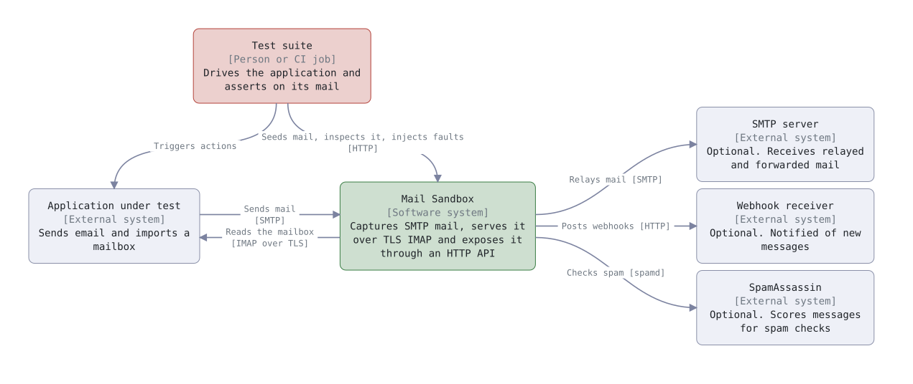
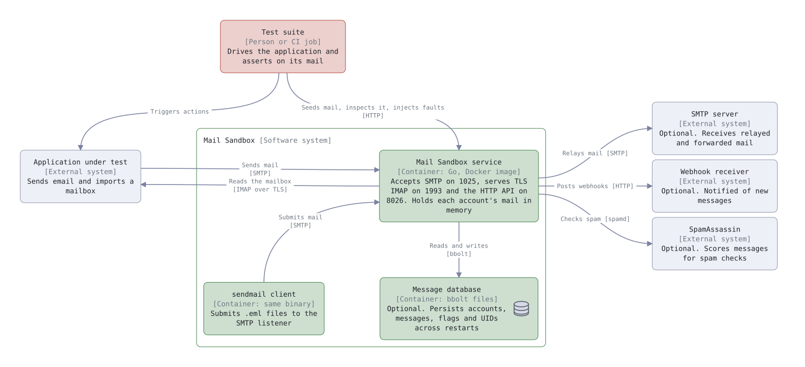
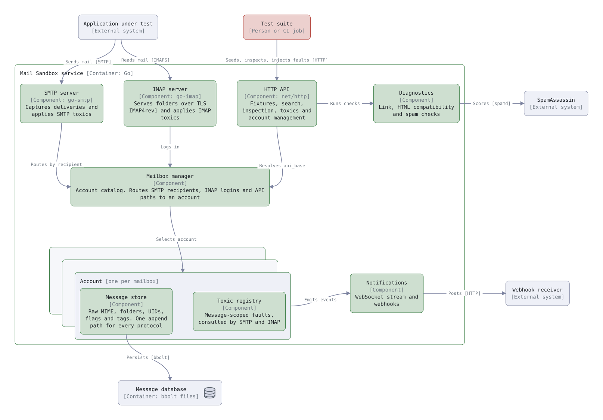

# Architecture

Three diagrams following the [C4 model](https://c4model.com/), each zooming
one level further in: the system in its environment, the containers it runs
as, and the components inside the service.

**Key:** green boxes are part of Mail Sandbox, red is a person, grey is
outside the system. The grey bracket under each name gives the element type
and technology. Arrows show the direction of the request or data flow.

## 1. System context

<picture>
  <source media="(prefers-color-scheme: dark)" srcset="../architecture/context-dark.svg">
  
</picture>

- The application talks to the sandbox as it would to a real mail provider:
  it sends over SMTP and reads its mailbox over IMAP.
- The test suite talks to the sandbox over HTTP only, to seed mail, check what
  arrived and inject faults.
- Everything on the right is optional and off by default. Captured mail is
  never delivered onward.

## 2. Containers

<picture>
  <source media="(prefers-color-scheme: dark)" srcset="../architecture/containers-dark.svg">
  
</picture>

- **Mail Sandbox service:** one Go process with three listeners. Mail is held
  in memory by default.
- **Message database:** bbolt files, used only when `MP_DATABASE` is set. See
  [persist mail](../how-to/run-and-test.md#persist-mail).
- **sendmail client:** the same binary run as `mail-sandbox sendmail`, for
  submitting `.eml` files from scripts.

## 3. Components of the service

<picture>
  <source media="(prefers-color-scheme: dark)" srcset="../architecture/components-dark.svg">
  
</picture>

| Component | Code | Role |
| --- | --- | --- |
| SMTP server | `smtp.go` | Captures deliveries and applies SMTP toxics |
| IMAP server | `mailbox.go` | Serves folders and messages to IMAP clients, applying IMAP toxics |
| HTTP API | `api.go`, `control.go`, `send.go`, `search.go` | Fixtures, search, inspection, toxics and accounts |
| Mailbox manager | `accounts.go` | Account catalog; maps recipients, logins and `api_base` paths to an account |
| Message store | `store.go`, `message.go` | One per account: raw MIME, folders, UIDs, flags, tags |
| Toxic registry | `toxics.go` | One per account: message-scoped faults |
| Notifications | `notifications.go` | WebSocket events and webhooks |
| Diagnostics | `diagnostics.go`, `htmlcheck.go` | Link, HTML compatibility and spam checks |

All code is in `internal/sandbox/`. The key design choice is that every
protocol writes through the same store, so HTTP and IMAP always see the same
message. [Design](design.md) explains the locking and isolation rules.

## Editing the diagrams

The sources are the `.reladraw` files in [`docs/architecture/`](../architecture/),
written in [reladraw](https://github.com/reladraw/reladraw). After editing one,
regenerate the light and dark SVGs (requires Node.js) and commit both:

```sh
make diagrams
```
