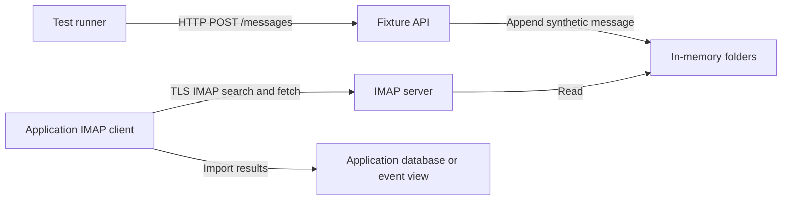

# How the emulator works

The emulator lets a test control the contents of a mailbox while the
application uses its normal IMAP connection. This exercises authentication,
TLS, folder scanning, searching, fetching, and application import behavior
without a real mailbox account.

## Two interfaces, one mailbox backend

The fixture API validates JSON and constructs a plain-text MIME message.
It appends that message to the same in-memory folder used by the IMAP server.
There is no queue between the two interfaces: after a successful HTTP response,
the message is available to an IMAP query.

The application decides when to poll and what to import. The emulator has no
knowledge of patients, event tables, historical backfills, or sync intervals.
A fixture's creation and its appearance in the application's UI are separate
events, so integration tests wait for the application result after seeding.

## Why the mailbox is temporary and append-only

In-memory storage gives each process a clean starting point. Tests can
reproduce a scenario by replaying their fixture requests, without managing a
mail database or persistent volume.

Within that process, the emulator permits appends while rejecting folder
mutations, flag changes, copies, and expunges. Existing message UIDs therefore
stay stable while clients poll. Tests set initial flags in their fixtures and
create cross-folder copies by appending the same Message-ID themselves.

A per-folder mutex coordinates HTTP writes with IMAP reads, searches, and
status requests. This avoids races in the underlying memory backend. It does
not isolate tests logically: all clients use the same account, so parallel
tests still need unique identifiers or separate instances.

Restarting discards the mailbox and chooses a fresh random UIDVALIDITY. An
importer must recognize the new mailbox generation instead of continuing from
an old UID cursor. Message-ID can help an application recognize mail copied
across folders, but the emulator intentionally retains duplicates so that
behavior can be tested.

## Why TLS is part of the test

The endpoint uses implicit TLS and includes a shared test certificate. Clients
explicitly trust that certificate and verify the hostname. This allows tests
to exercise the same certificate-validation path as a normal IMAP connection.
The supplied names cover host access and the default Compose service name.

The certificate, key, and account credentials are public test fixtures. The
HTTP API is unauthenticated, and the supplied Compose file publishes ports on
loopback. These choices suit controlled local and CI environments.

## The boundary with SMTP

SMTP delivery and IMAP retrieval are separate test concerns. This emulator
models a mailbox available for retrieval; it neither accepts SMTP deliveries
nor sends messages to recipients.

A test of an application's outgoing mail can use a separate SMTP capture
service such as Mailpit. If that test also needs the sent email to be visible
over IMAP, it seeds a corresponding `Sent` fixture explicitly, preserving the
Message-ID when relevant. No automatic bridge connects the services.

The emulator also does not decide whether an application stores bodies or
only metadata, how it deduplicates messages, or which timestamp becomes an
event's occurrence time. Those are application policies that fixtures help
exercise.

For concrete steps, see [integrate with your application](../how-to/integrate-with-application.md)
and [seed test scenarios](../how-to/seed-test-scenarios.md). For the exact
behavior, see the [IMAP reference](../reference/imap-behavior.md).

[Documentation index](../README.md)
